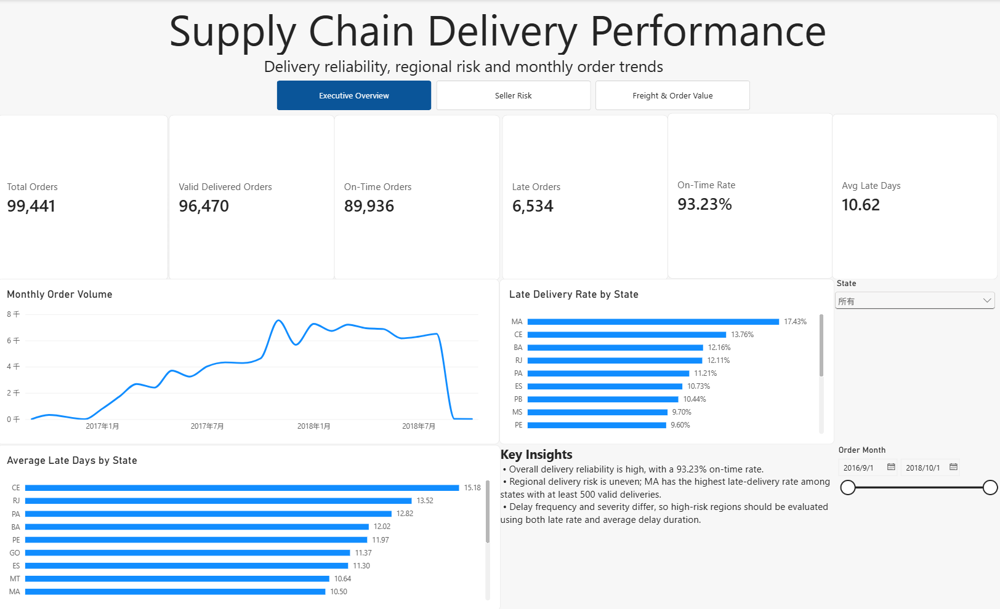
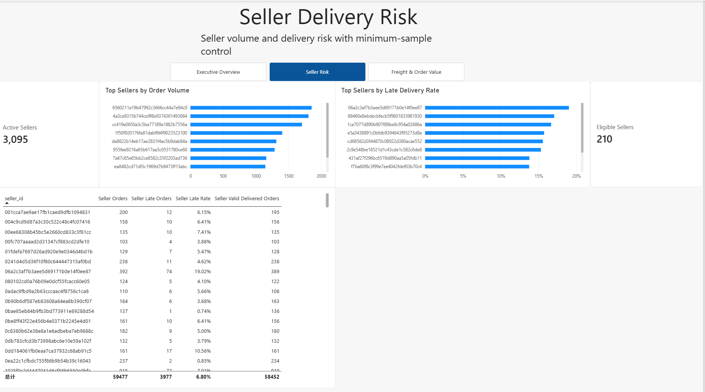
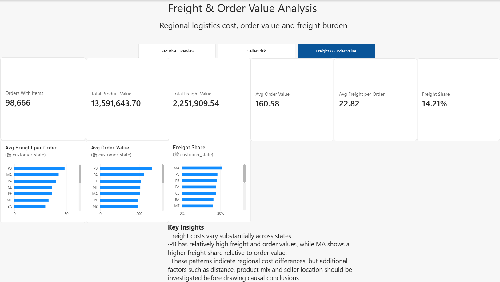

# Supply Chain Operations Analytics

Excel, SQL, and Power BI analysis of e-commerce order fulfillment, delivery performance, seller risk, and freight economics.

## Project Overview

This project analyzes **99,441 e-commerce orders** to evaluate delivery reliability, regional delivery risk, seller performance, and freight economics.

The workflow uses **Excel** for exploratory KPI modeling and formula-based checks, **PostgreSQL** for authoritative data validation and analytical querying, and **Power BI** for interactive reporting and KPI monitoring.

A key focus of the project is maintaining the correct analytical grain when joining order-level and item-level data, and validating dashboard metrics against SQL results before drawing business conclusions.

## Business Questions

The analysis focuses on five questions:

1. How reliable is the overall delivery process?
2. Which customer regions show elevated delivery risk?
3. Which sellers combine meaningful order volume with higher late-delivery risk?
4. How do freight cost, order value, and freight share vary across regions?
5. Are delay frequency and delay severity concentrated in the same regions?

## Dataset and Data Model

The analysis uses three core tables:

- `orders` — one row per order
- `customers` — customer and regional attributes
- `order_items` — item-level product, seller, price, and freight information

### Key Relationships

- `customers.customer_id` → `orders.customer_id`
- `orders.order_id` → `order_items.order_id`

Because `order_items` has a one-to-many relationship with `orders`, item-level rows cannot be interpreted directly as order counts. Distinct order counts and order-level aggregation are used where required to avoid double-counting.

```text
customers
    |
    | customer_id
    v
orders
    |
    | order_id
    v
order_items
```

## Tools and Techniques

### Tools

- PostgreSQL
- DBeaver
- Power BI Desktop
- Excel

### Excel Techniques

- formula-based delivery classification with `IF`, `COUNTIF`, and `COUNTIFS`
- cross-sheet mapping with `XLOOKUP`
- order-level value aggregation with `SUMIFS`
- conditional averages with `AVERAGEIF` and `AVERAGEIFS`
- date transformations with `DATE`, `YEAR`, and `MONTH`
- seller-order bridge construction and KPI checks
- monthly trend analysis and charting

### SQL Techniques

- JOINs
- Conditional aggregation
- Common Table Expressions (CTEs)
- Window functions
- `LAG`, `RANK`, `ROW_NUMBER`
- Data-quality validation

### Power BI / DAX

- Data modeling
- Measures and filter context
- `CALCULATE`
- `FILTER`
- `DIVIDE`
- `AVERAGEX`
- `RELATED`
- `TREATAS`
- `RANKX`

## KPI Definitions

### Valid Delivered Order

An order is considered valid for delivery-performance analysis when:

- `order_status = 'delivered'`
- the actual delivery date is available
- the estimated delivery date is available

### On-Time Order

An order is classified as on time when:

```text
actual delivery date <= estimated delivery date
```

Dates are compared at the **calendar-day level** to avoid incorrectly classifying deliveries made later on the promised day as late.

### Late Rate

```text
Late Orders / Valid Delivered Orders
```

### Average Late Days

Average number of days late among **late orders only**.

### Freight Share

```text
Total Freight Value / (Total Product Value + Total Freight Value)
```

## Key Results

### Overall Delivery Performance

- **Total Orders:** 99,441
- **Valid Delivered Orders:** 96,470
- **On-Time Orders:** 89,936
- **Late Orders:** 6,534
- **On-Time Rate:** 93.23%
- **Late Rate:** 6.77%
- **Average Late Days:** 10.62 days

### Regional Risk

Among states with at least **500 valid delivered orders**:

- **MA** recorded the highest late-delivery rate at approximately **17.43%**.
- **CE** had a lower late rate than MA but a higher average delay duration.
- Delay frequency and delay severity were therefore not concentrated in exactly the same regions.

### Seller Risk

- **Active Sellers:** 3,095
- Seller-risk comparisons were restricted to sellers with at least **100 valid delivered orders** to reduce small-sample distortion.
- High order volume did not necessarily imply high delivery risk.

### Freight and Order Value

- **Orders With Items:** 98,666
- **Total Product Value:** 13,591,643.70
- **Total Freight Value:** 2,251,909.54
- **Average Order Value:** 160.58
- **Average Freight per Order:** 22.82
- **Freight Share:** 14.21%

## Excel Analysis Workbook

The final Excel workbook, [`Supply_Chain_Excel_Analysis.xlsx`](excel/Supply_Chain_Excel_Analysis.xlsx), preserves the spreadsheet stage of the project. It includes:

- order-level delivery classification and delay calculations
- item count, product value, freight value, total order value, and freight-share calculations
- customer city and state mapping with `XLOOKUP`
- a seller-order bridge for seller-level KPI checks
- a final KPI assessment covering delivery, regional, and seller performance
- monthly late-order trend analysis and charting

Excel was used for exploratory analysis and formula-level validation. PostgreSQL was later used as the authoritative validation layer for the final regional metrics and Power BI dashboard.

## Power BI Dashboard

### 1. Executive Overview

Provides a high-level view of delivery performance, including:

- overall delivery KPIs
- monthly order trends
- regional late-delivery rates
- average late days by state
- state and date filtering

### 2. Seller Risk

Focuses on seller-level delivery performance, including:

- active and eligible seller counts
- top sellers by order volume
- top sellers by late-delivery rate
- a detailed seller delivery-performance table

Seller-risk ranking uses a minimum sample threshold of **100 valid delivered orders**.

### 3. Freight & Order Value

Examines logistics cost and order economics, including:

- product and freight value KPIs
- average order value
- average freight per order
- freight share
- regional comparisons

### Dashboard Preview







## Data Validation

Excel was used for exploratory checks and KPI prototyping, while SQL was used as the authoritative validation layer before building and finalizing the Power BI measures.

Validation steps included:

- reconciling total order counts
- checking delivered orders with missing delivery dates
- checking non-delivered orders with recorded delivery dates
- verifying order-item join cardinality
- reconciling Power BI KPIs with PostgreSQL query results
- validating regional metrics through `customer_id` joins

During the analysis, an earlier regional mapping issue was identified and corrected. The final regional analysis therefore uses validated customer-ID relationships.

## Limitations

This analysis is **descriptive** and does not establish causal relationships.

The dataset does not provide all variables required to explain delivery delays, including:

- shipping distance
- product weight and dimensions
- detailed carrier performance
- shipment route information
- seller-to-customer distance

Therefore, associations between freight metrics, regions, sellers, and delivery performance should not be interpreted as direct causal effects.

The beginning and ending periods of the dataset also contain partial observations. As a result, the sharp decline in monthly orders near the end of the time series should not be interpreted as a real business collapse.

## Repository Structure

```text
Supply_Chain_Analytics/
├── data/
│   └── Olist source CSV files
├── excel/
│   └── Supply_Chain_Excel_Analysis.xlsx
├── sql/
│   ├── basic_queries.sql
│   ├── aggregation.sql
│   ├── joins.sql
│   ├── conditional_aggregation.sql
│   ├── cte_analysis.sql
│   ├── window_functions.sql
│   └── final_analysis.sql
├── powerbi/
│   └── Supply_Chain_Analysis_Final.pbix
├── screenshots/
│   ├── Supply_Chain_Delivery_Performance.png
│   ├── Seller_Delivery_Risk.png
│   └── Freight&Order_Value_Analysis.png
└── README.md
```
